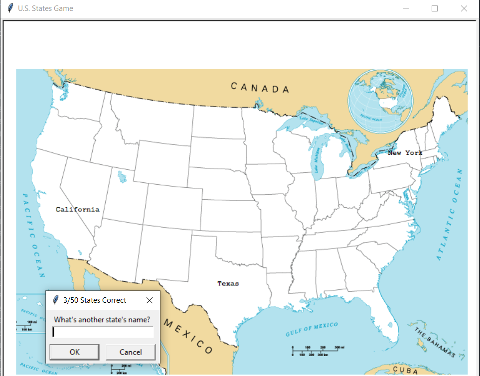

# U.S. States Game

A simple game to help you learn all 50 U.S. states. Built using
Python with the Turtle graphics module and pandas.

## Description

This game challenges the player to name all 50 U.S. states.
When a correct state name is entered, it appears on the U.S. map at the corresponding location.
If the user clicks "Cancel" or types "Exit", the game ends and a list of the remaining (unanswered)
states is saved to a CSV file.

## Features

- **Graphical display of correctly guessed states on a U.S. map**
- **Input tracking to prevent duplicate guesses**
- **Saves a list of missed states to 'states_to_learn.csv'**

## Technologies Used

- **Python 3.12.2**
- **'turtle' for graphics**
- **'pandas' for CSV handling**

## File Overview

- **'main.py' - the main Python script containing the game logic.**
- **'50_states.csv' - contains U.S. state names and their (x, y) map coordinates.**
- **'states_to_learn.csv' - automatically created at the end of the game with the list of states you didn't guess.**
- **'blank_states_img.gif' - map background used to display state names.**
  